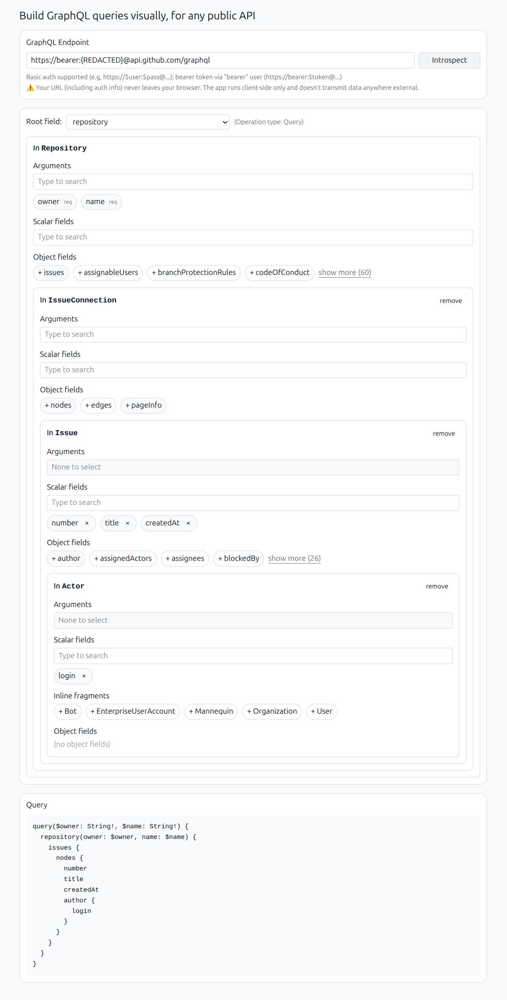

## gqlvis

Build GraphQL queries visually, for any public API

GraphQL is powerful, but writing queries by hand is a bit tricky for complex queries.

Manual query writing requires you to juggle multipage schema docs to figure out types' fields and arguments,
parent-child relationships, polymorphic types, etc. In large schemas (think GitHub's API with hundreds of types and
arguments), things can become really tedious.

This app automates GraphQL query exploration. It connects directly to any public GraphQL API, reads its schema under the
hood, and gives you a visual builder to compose queries interactively.

👉 Give it a try: https://gqlvis.hadid.dev/

> [!NOTE]
> Only queries are supported; mutation and subscriptions are not.

### Run it locally

```
npm install
npm run dev
```

### Github API example


